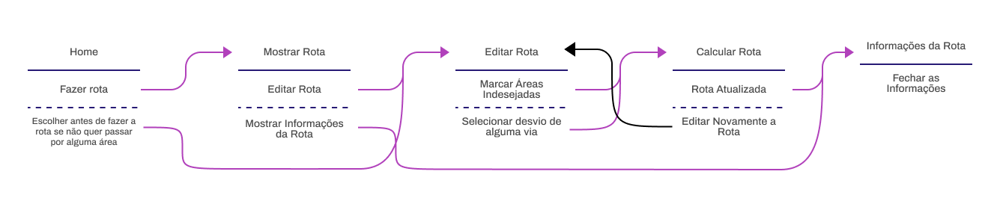

# Projeto de Interface

## User Flow

> Fluxo de usuário (User Flow) é uma técnica que permite ao desenvolvedor
> mapear todo fluxo de telas do site ou app. Essa técnica funciona
> para alinhar os caminhos e as possíveis ações que o usuário pode
> fazer junto com os membros de sua equipe.
>
> **Links Úteis**:
>
> - [User Flow: O Quê É e Como Fazer?](https://medium.com/7bits/fluxo-de-usu%C3%A1rio-user-flow-o-que-%C3%A9-como-fazer-79d965872534)
> - [User Flow vs Site Maps](http://designr.com.br/sitemap-e-user-flow-quais-as-diferencas-e-quando-usar-cada-um/)

* * *

## Wireframes

### Fluxo 1: Usuário editar rota **antes** dela ser feita

### 1 - Home

### 2 - Menu Mudar Rota

### 3 - Marcar Áreas Indesejadas (antes de fazer rota)

### 4 - Rota Feita (exibindo áreas indesejadas)

### 5 - Mostrar Rota

### 6 - Mostrar Informações da Rota

* * *

### Fluxo 2: Usuário editar rota **depois** dela ser feita

### 1 - Home

### 2 - Mostrar Rota

### 3 - Editar Rota (após ela ser feita)

### 4 - Marcar Áreas Indesejadas (após criar rota)

### 5 - Rota Atualizada (após marcar áreas indesejadas)
> A área demarcada em vermelho indica os locais indesejados de passar.

### 6 - Mostrar Rota Atualizada

### 7 - Mostrar Informações da Rota (com a rota atualizada)

